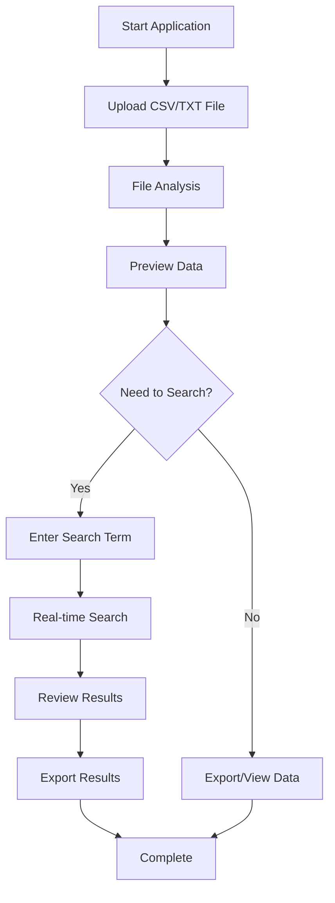
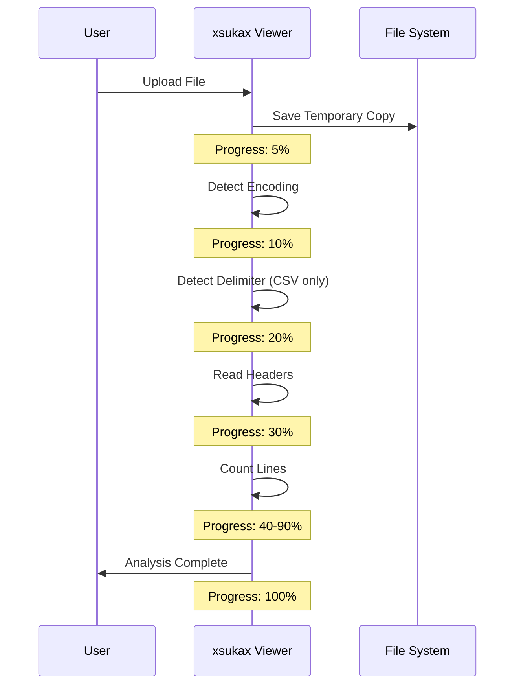
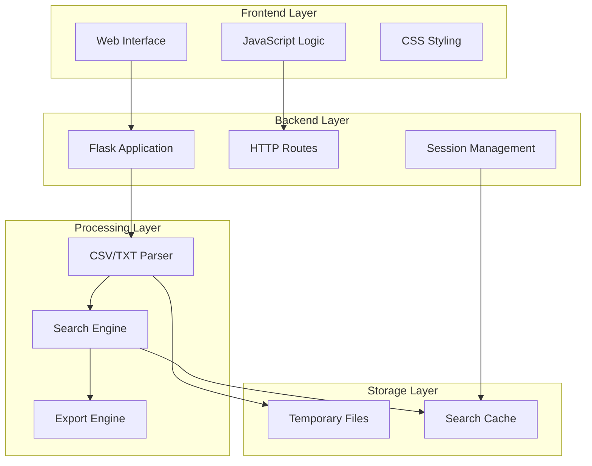

# xsukax Large CSV Viewer


## Project Overview

**xsukax Large CSV Viewer** is a professional, web-based application designed specifically for handling and analyzing large CSV and text files that are too massive for conventional spreadsheet software. Built with Python and Flask, it provides a robust, browser-based interface for searching, previewing, and exporting data from files that can exceed several gigabytes in size.

The application intelligently handles various file encodings, delimiters, and formats, making it an essential tool for data analysts, researchers, and developers working with large datasets. Unlike traditional CSV viewers that load entire files into memory, xsukax processes files in chunks, enabling efficient handling of files that would otherwise crash standard applications.

### Primary Functionalities:
- **Large File Support**: Handle CSV/TXT files up to 50GB without memory constraints
- **Advanced Search**: Real-time search with highlighting across entire datasets
- **Smart Encoding Detection**: Automatic detection of file encoding and delimiters
- **Progressive Loading**: View file previews without loading entire contents
- **Export Capabilities**: Export search results as clean CSV files
- **Web-Based Interface**: Accessible from any modern browser

## Security and Privacy Benefits

xsukax is designed with security and privacy as foundational principles, ensuring your sensitive data remains protected throughout the entire workflow:

### 🔒 Local Processing
- **No Data Transmission**: All file processing occurs locally on your machine
- **No Cloud Dependency**: No internet connection required after initial setup
- **Temporary Storage**: Uploaded files are stored temporarily and can be configured for automatic cleanup

### 🛡️ Security Measures
- **Controlled Access**: Server runs on localhost (127.0.0.1) by default, preventing external access
- **Input Validation**: Comprehensive validation of all user inputs to prevent injection attacks
- **Memory Management**: Efficient chunk-based processing prevents memory exhaustion
- **File Size Limits**: Configurable maximum file size protection

### 📊 Privacy Protection
- **No Telemetry**: Application does not collect usage statistics or personal data
- **No Third-Party Services**: All functionality is self-contained without external dependencies
- **Session Isolation**: Separate search sessions prevent data leakage between users
- **Clean Export**: Exported results are stripped of HTML markup for data purity

## Features and Advantages

### ✨ Key Benefits
- **Massive File Handling**: Process files that exceed Excel and other spreadsheet software limits
- **Performance Optimized**: Intelligent chunking and streaming for optimal memory usage
- **Cross-Platform Compatibility**: Runs on Windows, macOS, and Linux systems
- **No Installation Required**: Single Python script with minimal dependencies
- **Real-time Progress Tracking**: Visual feedback for uploads and search operations
- **Highlighted Results**: Search matches are visually highlighted for easy identification

### 🚀 Unique Selling Points
- **Zero Learning Curve**: Intuitive web interface familiar to most users
- **Professional-Grade**: Built for enterprise-level data analysis tasks
- **Open Source Transparency**: Full visibility into codebase and algorithms
- **Customizable**: Easily modifiable to suit specific workflow requirements

## Installation Instructions

### Prerequisites
- Python 3.7 or higher
- pip (Python package manager)

### Step-by-Step Installation

1. **Clone or Download the Application**
   ```bash
   # Option 1: Download the script directly
   wget https://raw.githubusercontent.com/xsukax/xsukax-Large-CSV-Viewer/refs/heads/main/xsukax-csv-viewer.py
   
   # Option 2: Clone the repository
   git https://github.com/xsukax/xsukax-Large-CSV-Viewer.git
   cd xsukax-Large-CSV-Viewer
   ```

2. **Install Required Dependencies**
   ```bash
   pip install flask psutil
   ```

3. **Run the Application**
   ```bash
   python xsukax-csv-viewer.py
   ```

4. **Access the Application**
   - Open your web browser
   - Navigate to: `http://localhost:5000`
   - The application interface will load automatically

### Platform-Specific Notes

**Windows Users:**
- Ensure Python is added to your PATH during installation
- Run Command Prompt or PowerShell as Administrator if encountering permission issues

**macOS/Linux Users:**
- Use `python3` command if both Python 2 and 3 are installed
- Consider using a virtual environment for dependency isolation:
  ```bash
  python3 -m venv xsukax-env
  source xsukax-env/bin/activate
  pip install flask psutil
  python xsukax-csv-viewer.py
  ```

## Usage Guide

### Basic Workflow



### Detailed Usage Instructions

#### 1. **File Upload**
- Drag and drop your CSV or TXT file onto the upload zone
- Or click "Select File" to browse your file system
- The application will automatically analyze the file structure

#### 2. **File Analysis Process**


#### 3. **Data Preview**
- View the first 100-200 rows of your data
- Column headers are automatically detected for CSV files
- Content is displayed in a sortable, scrollable table

#### 4. **Advanced Search**
- Enter your search term in the search box
- Click "Search" or press Enter to begin
- Monitor progress through the real-time status bar
- Results appear incrementally as they're found

#### 5. **Result Management**
- Browse through paginated results
- Export specific pages or entire result sets
- Results include highlighted search terms for easy identification

### Advanced Features

#### Custom Search Options
The application supports:
- Case-insensitive searching
- Partial matching within cells
- Cross-column searching for CSV files
- Progressive result loading

#### Export Options
- Clean CSV format without HTML markup
- Preserved original data structure
- Customizable filename with timestamp
- Full or partial result exports

### Performance Tips

1. **For Very Large Files (>10GB):**
   - Close other memory-intensive applications
   - Consider increasing system swap space
   - Use the stop feature if search takes too long

2. **Optimizing Search:**
   - Use specific rather than generic terms
   - The application searches all columns simultaneously
   - Complex patterns may require post-processing of exported results

3. **Memory Management:**
   - Application automatically manages memory through chunking
   - Monitor system resources through the footer display
   - Sessions automatically clean up after completion

## System Architecture



## Troubleshooting

### Common Issues and Solutions

**File Upload Fails:**
- Check file size (maximum 50GB)
- Verify file permissions
- Ensure adequate disk space in temp directory

**Encoding Detection Issues:**
- Application falls back to 'latin-1' encoding
- Manual encoding specification may be added in future versions

**Search Performance:**
- Very large files will take longer to search
- Consider filtering data before uploading
- Use more specific search terms

**Memory Usage:**
- Application is optimized for low memory footprint
- High usage may indicate very large simultaneous operations
- Restart application if memory accumulates

## Licensing Information

This project is licensed under the GNU General Public License v3.0. See the [LICENSE](LICENSE) file for full details.

### Key License Provisions:
- **Freedom to Use**: You are free to use this software for any purpose
- **Freedom to Study**: Access to source code allows modification and study
- **Freedom to Share**: You can distribute original or modified versions
- **Copyleft**: Derivative works must remain under GPLv3

For commercial licensing options or exceptions, please contact the project maintainers.

## Contributing

We welcome contributions from the community!

## Acknowledgments

xsukax Large CSV Viewer builds upon several open-source technologies including:
- [Flask](https://flask.palletsprojects.com/) - Web framework
- [psutil](https://github.com/giampaolo/psutil) - System utilities
- Python Standard Library - Core functionality

---

*xsukax Large CSV Viewer - Professional data handling for the modern analyst*
